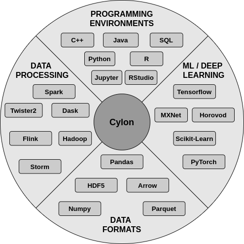
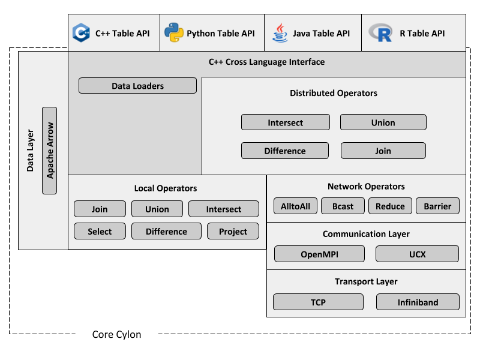
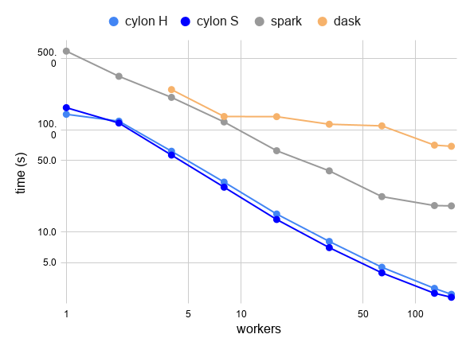

# Cylon 

[Cylon](https://github.com/cylondata/cylon) is a data engineering toolkit designed to work with AI/ML systems and 
integrate with data processing systems. *"Data engineering everywhere"* is the main vision of Cylon. 




It can be deployed either as a library or a framework. 
Big Data systems like [Apache Spark](https://spark.apache.org/), [Apache Flink](https://flink.apache.org/), [Twister2](https://twister2.org/), etc may use Cylon to boost the performance 
in the ETL pipeline. For AI/ML systems like [PyTorch](https://pytorch.org/), [Tensorflow](https://www.tensorflow.org/) and [Apache MXNet](https://mxnet.apache.org/), 
Cylon acts as a library to enhance ETL performance. Additionally, Cylon is being expanded to perform as a generic framework 
for supporting ETL and efficient distributed modeling of AI/ML workloads. 

Cylon currently provides a set of distributed data-parallel operators to extract, transform and load structured 
relational data. These operators are exposed as APIs in multiple programming languages (e.g., C++, Python, Java) 
that are commonly used in Machine Learning and Artificial Intelligence platforms, enabling tight integration with them. 
When an operator is invoked in any of these platforms, that invocation is delegated to the "Core Cylon" framework, 
which implements the actual logic to perform the operation in a distributed setting.



## Data Model 

Cylon workloads can be categorized as Online Analytical Processing (OLAP). The data layer of Cylon is based on [Apache Arrow](https://arrow.apache.org/).
*Arrow Columnar Format* provides the foundation for Cylon Table API. 

Using Apache Arrow has a number of advantages. 
- Seamless integration of other open source frameworks (ex: Spark, Pandas, Parquet, NumPy, etc)

- Zero copy reads, which drastically reduces the overhead of switching between language runtimes

- Allows SIMD operations on columns, data locality and cache, and effective compression of data.

## Operators 

Cylon offers both *local* and *distributed* operations. 

- *Local operators* - Work entirely on the data available and accessible locally to the process (Do not use network layer)

- *Distributes Operators* - Use the network layer at one or multiple points during the operator’s life-cycle 
(beginning, middle, or end) and apply *local operators* once the partitions are collected at each local process

Following operators are currently available in Cylon. 

1. **Select** - Filters out a set of rows based on the values of all or a subset of columns

2. **Project** - Creates a simpler view of an existing table by dropping one or more columns (It is considered the 
counterpart of Select, which works on columns instead of rows.

3. **Join** - Combines two tables based on the values of a common column (Inner, Left Outer, Right Outer, Full Outer 
joins are supported). Currently Cylon joins provide *sort* and *hash* join algorithms. 

4. **Union** - Concatenates two homogeneous tables (those having similar schema)

4. **Intersect** - Produces similar(equal) rows from two homogeneous tables

5. **Difference** - Takes the difference between two tables 

## Communication Layer

The communication layer of Cylon is currently implemented on OpenMPI. An implementation based on UCX is on the road-map 
which will enhance Cylon’s compatibility to run on a wide variety of hardware devices such as GPUs, and different 
processor architectures. Transport layer options will also be widened with different communication layer implementations.
Cylon uses synchronized producers and consumers for transferring messages.

## Transport Layer 

Currently, Cylon has the capability to communicate using any transport layer protocol supported by OpenMPI, 
including TCP and Infiniband. Additionally, all the tuning parameters of OpenMPI are applicable for Cylon 
since the initial implementation is entirely written based on the OpenMPI framework.

## *Data Processing Everywhere*

### Data Processing Library
Cylon can be directly imported as a library to an application written in another framework. In a Python program, this
integration is a simple module import. Cylon Python API currently supports Google Colab with an experimental version
and supports Jupyter Notebooks with fully-fledged compatibility.

```python
from torch import Tensor as TorchTensor
from pycylon.data.table import Table, csv_reader
#...

file = "data.csv"
tb = csv_reader.read(file, ",")

# Does data pre-processing
#...

tb_arw = Table.to_arrow(tb)
npy = tb_arw.to_pandas().to_numpy()
tensor = torch.from_numpy(npy)
#...
```

```c++
#include <net/mpi/mpi_communicator.h>
#include <ctx/cylon_context.h>
#include <table.hpp>

using namespace cylon;
//...

int main(int argc, char *argv[]) {
  std::shared_ptr<Table> table1, table2, joined;

  // initializing cylon in distributed mode
  auto mpi_config = new MPIConfig();
  auto ctx = CylonContext::InitDistributed(mpi_config);
  auto read_options = CSVReadOptions().UseThreads(true);

  // loading multiple table partitions concurrently
  auto status = Table::FromCSV(ctx, {
      "/path/to/csv1.csv",
      "/path/to/csv2.csv"
  }, {table1, table2}, read_options);

  if (status.is_ok()) {
    auto join_config = JoinConfig::InnerJoin(0, 0);
    auto join_status = table1->DistributedJoin(table2, join_config, &joined);
    if (join_status.is_ok()) { // writing the partition of this worker back to the disk
      joined->WriteCSV("/path/to/out.csv");
    } else {
      // failed
    }
  } else {
    // failed
  }
  ctx->Finalize();
  return 0;
}
```

### Data Processing Framework

Cylon can also perform as a separate standalone distributed framework to process data. As a distributed framework, Cylon
should bring up the processes in different cluster management environments such as Kubernetes, Slurm and Yarn. Cylon has
a distributed backend abstraction to plug in various cluster process management systems. Currently, it works as a
standalone framework with the MPI backend.

## Performance results 

Following is the Cylon performance on Joins against Apache Spark and Dask. 

| Workers | Dask Time \(s\) | Spark Time \(s\) | Cylon Time \(s\) | Cylon v\. Dask | Cylon v\. Spark |
|---------|-----------------|------------------|------------------|----------------|-----------------|
| 1       | \-              | 586\.5           | 141\.5           | \-             | 4\.1x           |
| 2       | \-              | 332\.8           | 116\.2           | \-             | 2\.9x           |
| 4       | 246\.7          | 207\.1           | 56\.5            | 4\.4x          | 3\.7x           |
| 8       | 134\.6          | 119\.0           | 27\.4            | 4\.9x          | 4\.3x           |
| 16      | 134\.2          | 62\.3            | 13\.2            | 10\.1x         | 4\.7x           |
| 32      | 113\.1          | 39\.6            | 7\.0             | 16\.1x         | 5\.6x           |
| 64      | 109\.0          | 22\.2            | 4\.0             | 27\.4x         | 5\.6x           |
| 128     | 70\.6           | 18\.1            | 2\.5             | 28\.1x         | 7\.2x           |
| 160     | 68\.9           | 18\.0            | 2\.3             | 30\.0x         | 7\.8x           |


